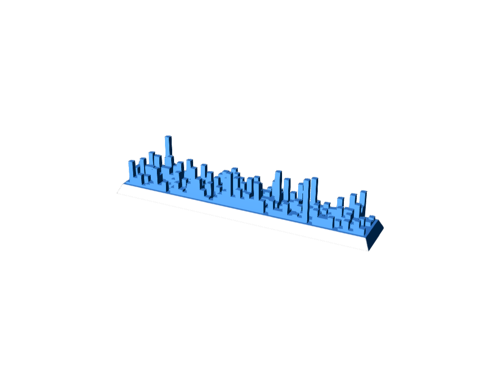
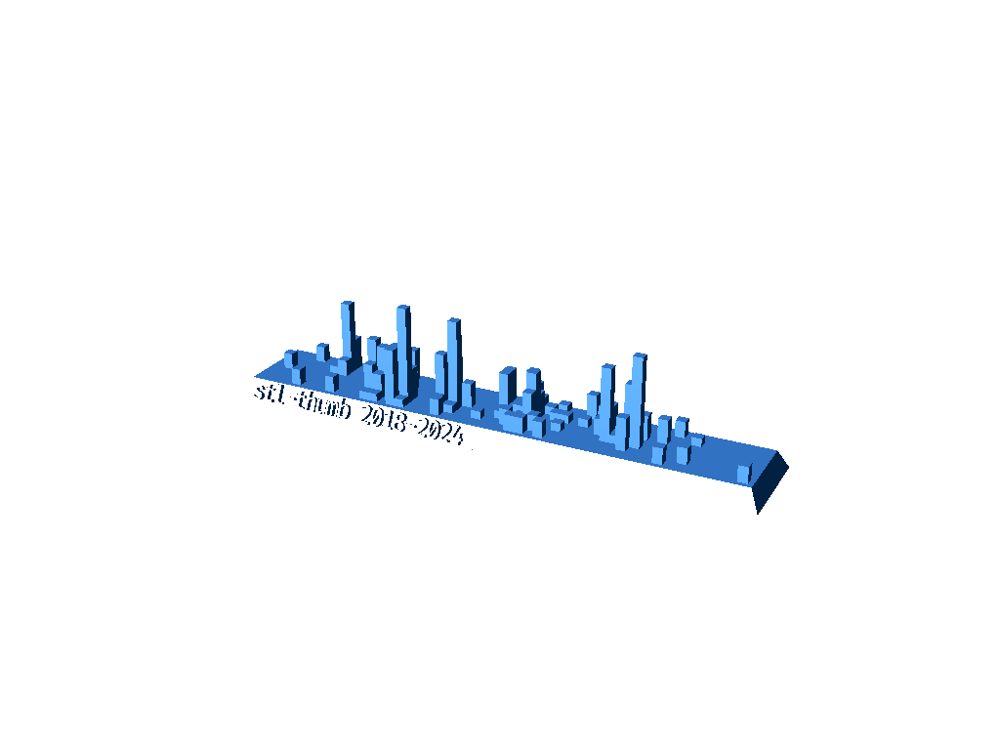

# Generate Git 3D Commit History Trophy

## Basic

```
cargo run --release ~/clones/cargo
```

> generates `trophy.ply` and `trophy.stl`



> preview generated using [stl-thumb (https://github.com/unlimitedbacon/stl-thumb)](https://github.com/unlimitedbacon/stl-thumb)

## With side text

```
cargo run --release -- --font fonts/FiraCode-Medium.ttf --text "stl-thumb 2018-2024" ~/clones/stl-thumb
```

> generates `trophy.ply` and `trophy.stl`



## License

Dual-licensed under MIT or the Apache License V2.0.
